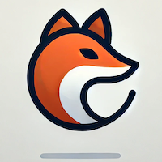

# EVENTWIRED

A lightweight, async-first web framework built with modern web development in mind. **This is a work in progress** that primarily serves **educational purposes**.

🔗 **[Live Demo](https://yasgi-frame.work)**

---

## Tools of the trade
- Python 3.12.3

## How to run

1. Clone this repository
    ```bash
    $ git clone https://github.com/yerco/eventwired.git
    ```

2. Go to the cloned folder, create a virtualenv and activate it (optional)
   ```bash
   $ python -m venv venv
   
    $ source venv/bin/activate
   ```
   This avoids potential issues with `uvicorn` and pyenv.

3. Install the required packages
   ```bash
   $ pip install -r requirements.txt
   ```

4. Run the server

   Currently, the server supports **Uvicorn**.

   You can specify your own application to serve using the `--app` argument. If no application is provided, the default app `demo_app.app:app will be served.

   **Using Uvicorn:**
   ```bash
   $ python run_server.py [--app your_app:app] [--reload] [--host 127.0.0.1] [--port 8000]
   ```
   - `--app`: Optional. The path to your ASGI application (e.g., `your_app:app`). Defaults to `demo_app.app:app`.
   - `--reload`: Optional. Enable auto-reload on code changes.
   - `--host`: Optional. The host to bind the server to. Default is `127.0.0.1`.
   - `--port`: Optional. The port to bind the server to. Default is `8000`.

   Visit the server at http://127.0.0.1:8000

## Testing
   ```bash
   $ pytest
   
   $ pytest --cov=src tests/
   
   $ pytest --cov=demo_app --cov-report=html
   ```

## Why use EVENTWIRED

EVENTWIRED was built as an exploratory tool to understand and teach asynchronous, event-driven architectures (EDM). It’s designed for developers who want to explore real-time, non-blocking operations in a manageable, lightweight framework.

### What makes EVENTWIRED different?

- **Event-Driven Architecture (EDM)**:EVENTWIRED employs an event bus for handling system events like 404/500 errors, WebSocket connections, or custom user-defined events. This makes it flexible and ideal for real-time features like chat apps or IoT.
- **Asynchronous by Design**: Built to leverage Python’s async capabilities, EVENTWIRED makes real-time apps scalable and performant.
- **Microservices-Ready**: It’s lightweight and built to scale easily in microservices architectures.

## Event Handling Example

In EVENTWIRED, events are managed using an event-driven approach. You can listen for specific events and define your custom behavior. Here’s an example of how to capture successful user login attempts while storing that information in a database.

   ```python
   # demo_app/subscriber_setup.py
   def register_subscribers(event_bus):
       event_bus.subscribe("user.login.success", log_event_to_db)
   ```

   ```python
   # demo_app/subscribers/event_log_subscriber.py
   async def log_event_to_db(event: Event):
      orm_service = await di_container.get('ORMService')
   
      await orm_service.create(EventLog, event_name=event.name, additional_data=str(event.data))
   ```
This system enables you to define your app’s responses to events, offering flexibility for error handling, logging, and more.

## User-Centric Framework Design

EVENTWIRED is designed to provide flexibility without enforcing a rigid structure. The framework allows you to integrate routing, event handling, and services in a way that suits your application’s needs.

The `demo_app`  provided with the framework serves as an example of how to structure a project, demonstrating key components such as dependency injection, routing, and templating. By exploring and running the demo_app, you’ll gain insights into leveraging EVENTWIRED’s features to build your own ASGI applications.

## Important Note

For most developers, everything needed to build your project is found within the `demo_app` folder. It serves as the go-to example for project structure and implementation. The `src` folder contains the internal framework workings and typically doesn't need to be modified.

## Example Routes

Define routes easily with Python:
   ```python
   from demo_app.controllers.welcome_controller import welcome_controller
   
   def register_routes(routing_service):
       routing_service.add_route('/', 'GET', welcome_controller)
   ```
   
## Example Controllers

Controllers are simple Python functions that handle requests and return responses. They can be as simple or complex as needed. Here’s an example of a controller that renders an HTML template:

   ```python
   from src.controllers.base_controller import BaseController
from src.core.event_bus import Event
from demo_app.di_setup import di_container


async def welcome_controller(event: Event):
    controller = BaseController(event)
    template_service = await di_container.get('TemplateService')
    rendered_content = template_service.render_template('welcome.html', {})
    await controller.send_html(rendered_content)
   ```
   
## Real-Time Chat Room Example

With EVENTWIRED, you can create a real-time chat room with just a few lines of code. The `demo_app` includes a chat room available at `/chat_room`. Below is all you need to write to set up a chat room using WebSockets:

   ```python
   from src.controllers.base_controller import BaseController
from src.core.event_bus import Event
from demo_app.di_setup import di_container


async def chat_room_controller(event: Event):
    websocket_service = await di_container.get('WebSocketService')
    controller = WebSocketController(event)
    websocket_service.register_client(controller)

    async def on_message(message):
        if message not in {"websocket.connect", "websocket.disconnect"}:
            broadcast_message = f"User: {message}"
            await websocket_service.broadcast_message(broadcast_message)

    await websocket_service.accept_client_connection(controller)
    await websocket_service.listen(controller, on_message)
   ```

This, along with a simple HTML template and route setup, is enough to get your chat room running.

### Contribute

Feedback is warmly welcomed, contributions, or suggestions to improve EVENTWIRED. Whether it's reporting a bug, suggesting a feature, or sharing your thoughts, your input is invaluable to me.

If you'd like to contribute:
- Fork the repository.
- Create a new branch for your feature or bug fix.
- Submit a pull request with a description of your changes.

Please feel free to open an issue if you have questions or ideas. Every piece of feedback helps us make EVENTWIRED better!
